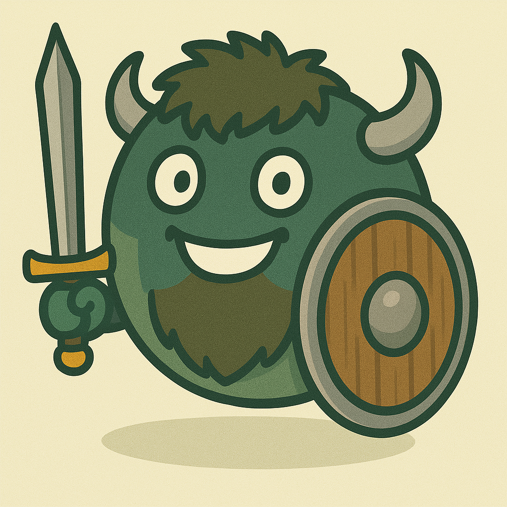

# Wisent-Guard

<p align="center">
  
</p>

<p align="center">
  <a href="https://github.com/wisent-ai/wisent-guard/stargazers">
    
  </a>
  <a href="https://pypi.org/project/wisent-guard/">
    
  </a>
  <a href="https://pypi.org/project/wisent-guard/">
    
  </a>
  <a href="https://github.com/wisent-ai/wisent-guard/blob/main/LICENSE">
    
  </a>
  <!-- Add Build Status here if configured, e.g., GitHub Actions -->
  <!-- <a href="[Link to Build Status]">
    
  </a> -->
</p>

**Monitor and Control Your Language Models with Neurosurgeon-like Precision!**

Wisent-Guard is a powerful open-source Python tool that allows you to "peek into the brain" of Language Models (LLMs) and actively shape their behavior. Say goodbye to uncontrolled hallucinations, harmful content generation, or the perpetuation of unwanted patterns. With Wisent-Guard, you regain control!

Created by the [Wisent AI](https://wisent.ai) team, led by [Lukasz Bartoszcze](https://lukaszbartoszcze.com).

## 🎯 The Problem We Solve

Large Language Models (LLMs) are revolutionary, but their "black-box" nature often leads to issues:
- **Hallucinations**: Generating false or nonsensical information.
- **Harmful Content**: Producing hateful, toxic, or inappropriate text.
- **Bias Perpetuation**: Reinforcing harmful stereotypes present in training data.
- **Lack of Control**: Difficulty in precisely steering model behavior without costly fine-tuning.

Traditional methods, such as post-generation filtering, are often insufficient and reactive. Wisent-Guard offers a proactive approach, operating directly within the model's latent space.

## 🧠 How Does Wisent-Guard Work?

Wisent-Guard operates by "reading the model's mind" through the analysis of its **internal neural activations**. Key concepts include:

1.  **Activation Monitoring**: We "tap into" selected model layers to observe how information is processed.
2.  **Contrastive Vectors**: We teach the model to distinguish between desired and undesired behavioral patterns. We create special "directional vectors" (e.g., "hallucination" vs. "fact", "toxic" vs. "neutral") based on example pairs.
3.  **Real-Time Detection**: During text generation, Wisent-Guard compares the model's current activations with the learned contrastive vectors.
4.  **Vector Steering**: If a pattern leading to unwanted content is detected, Wisent-Guard can actively "steer" the generation away from that direction in the latent space, promoting safer and more desirable responses.

It's like having a neurosurgeon for your AI, precisely intervening before a problem manifests.

## ✨ Key Features

- **Precise Detection**: Identify a wide range of unwanted behaviors (hallucinations, harmful content, bias) with high accuracy.
- **Active Generation Steering**: Don't just detect; prevent the generation of problematic content in real-time.
- **Train Custom Patterns**: Easily train your own contrastive vectors for specific problems and domains.
- **Flexibility**: Monitor any model layer and adjust detection sensitivity.
- **Integration**: Designed for easy integration with existing language model pipelines.
- **Support for Popular Models**: Works with Transformer-based models (from Hugging Face).

## 🚀 Quick Start

See how easily you can start monitoring your model!

### 1. Installation

```bash
pip install wisent-guard
```

### 2. Basic Detection

The following example shows how to load a model, Wisent-Guard, and check text against pre-trained (example) vectors for the "hallucination" category.

```python
from transformers import AutoModelForCausalLM, AutoTokenizer
from wisent_guard import ActivationGuard
import torch # Needed for creating/loading example vectors

# Step 1: Load your model and tokenizer
model_name = "gpt2" # You can use a different model
model = AutoModelForCausalLM.from_pretrained(model_name)
tokenizer = AutoTokenizer.from_pretrained(model_name)

# Step 2: Initialize ActivationGuard
# Assume you have pre-trained vectors in a directory like "./my_vectors"
# For this example, we'll create synthetic vectors
save_dir = "./quick_start_vectors" 
# Wisent-Guard will automatically create necessary directories if they don't exist

guard = ActivationGuard(
    model=model,
    tokenizer=tokenizer,
    layers=[5],  # Monitor activations from layer 5 (example)
    save_dir=save_dir,
    auto_load_vectors=False # We're not auto-loading because we'll create them now
)

# Step 3: Create an example (synthetic) vector for the "example_harmful" category
# In real use, you create vectors from pairs of examples (see: Training Vectors)
if not guard.vectors.get_available_categories(): # Only if no vectors exist yet
    print("Creating example vectors...")
    dummy_activation_safe = torch.randn(model.config.hidden_size)
    dummy_activation_harmful = torch.randn(model.config.hidden_size)
    
    guard.vectors.add_vector_pair(
        category="example_harmful",
        layer=5,
        harmful_vector=dummy_activation_harmful,
        harmless_vector=dummy_activation_safe
    )
    guard.vectors.compute_contrastive_vectors() # Compute the contrastive vectors
    guard.vectors.save_vectors() # Save them to disk
    print(f"Example vectors for category 'example_harmful' saved in {save_dir}")
    
    # Reload vectors so the monitor "sees" the new ones
    # (in normal use, auto_load_vectors=True would handle this)
    guard.load_vectors()


# Step 4: Check text
text_to_check = "This is an example text that might be harmful."
is_harmful_detected = guard.is_harmful(text_to_check)

if is_harmful_detected:
    triggered_category = guard.get_triggered_category(text_to_check)
    similarity = guard.get_similarity(text_to_check, category=triggered_category)
    print(f"Potentially harmful content detected!")
    print(f"  Category: {triggered_category}")
    print(f"  Activation similarity: {similarity:.4f}")
else:
    print("Text appears to be safe.")

# You can also generate a response with monitoring and steering enabled:
prompt = "Tell me something safe."
response = guard.generate_safe_response(prompt, max_new_tokens=50)
print(f"\nSafe response: {response['response']}")

# Remember to clean up if you created example vectors just for this demo
# import shutil
# shutil.rmtree(save_dir)
# print(f"Removed directory {save_dir}")
```

**What's happening here?**
- We loaded the `gpt2` model and its tokenizer.
- We initialized `ActivationGuard`, specifying which model layer to monitor (`layers=[5]`).
- **Important**: In this example, we create *synthetic* contrastive vectors for the `"example_harmful"` category, assuming you don't have your own trained vectors yet. In a real scenario, you would use the `train_on_phrase_pairs` method (described later) or load previously prepared vectors.
- The `is_harmful()` method analyzes the provided text. It "passes" it through the model, monitors activations in layer 5, and compares them with the vector for `"example_harmful"`.
- `get_triggered_category()` and `get_similarity()` provide more details if something is detected.
- `generate_safe_response()` shows how to generate text with active monitoring and potential steering.

This simple example only scratches the surface. Read on to learn how to train your own vectors and fully leverage the power of Wisent-Guard!

<!-- Placeholder for GIF/Short Video showing Quick Start in action -->
<!-- <p align="center">
  
</p> -->

## 💡 Key Concepts

To fully understand Wisent-Guard, it's helpful to delve into a few core ideas:

### Activation Monitoring
Language models, like Transformers, consist of multiple layers. Each layer processes input data (text tokens) and generates **neural activations** – vectors of numbers representing the model's "state of mind" at that processing stage. Wisent-Guard allows you to select specific layers and "listen in" on these activations, typically for the last token in a sequence (other strategies exist, but "last token" is default and usually most effective). This gives us insight into how the model "understands" and "plans" to generate the next token.

### Contrastive Vectors
The heart of Wisent-Guard lies in **contrastive vectors**. These are special directional vectors in the activation space that represent the difference between desired and undesired model behavior.
- To create a vector for, say, "hallucination," you provide pairs of examples:
    - **Positive (undesired)**: An example text containing a hallucination.
    - **Negative (desired)**: An example text that is a correct, factual response to a similar query.
- Wisent-Guard passes both texts through the model, collects activations from the monitored layers, and then calculates the average difference between "hallucinatory" and "factual" activations. This averaged difference vector becomes the contrastive vector for the "hallucination" category.
- With such a vector, we can later, during new response generation, check if the model's current activations are "drifting" towards the "hallucination" direction.

### Vector Steering
This is where the magic of proactive intervention happens:
1.  During response generation, token by token, Wisent-Guard monitors activations.
2.  If the activations for the current token show high similarity to one of the contrastive vectors (e.g., "toxic") and exceed a defined `threshold`, the system knows the model is "heading" in an unwanted direction.
3.  Instead of letting the model continue, Wisent-Guard modifies the **logits** (the raw scores from the model before applying softmax to choose the next token).
4.  The modification involves "subtracting" the influence of the contrastive vector from the logits, proportional to the `vector_scale` parameter. In practice, this "pushes" the probability distribution away from unwanted tokens and favors those more aligned with a "safe" direction (implicitly represented by the inverse of the harmful vector or explicitly by a "harmless" vector from a pair).
5.  The effect? The model is subtly steered to avoid generating content matching the negative pattern, without needing fine-tuning.

The `vector_decay` parameter allows for a gradual reduction in steering strength as longer responses are generated, which can be useful to prevent excessive interference.

## 🛠️ Usage Examples

Below are more detailed examples showing how to harness the full potential of Wisent-Guard.

### Example 1: Training Your Own Contrastive Vectors

The greatest power of Wisent-Guard is the ability to define your own categories of undesired behavior.

```python
from transformers import AutoModelForCausalLM, AutoTokenizer
from wisent_guard import ActivationGuard

# Load model and tokenizer
model_name = "gpt2"
model = AutoModelForCausalLM.from_pretrained(model_name)
tokenizer = AutoTokenizer.from_pretrained(model_name)

# Initialize ActivationGuard
# Vectors will be saved in ./my_custom_vectors/hate_speech
guard = ActivationGuard(
    model=model,
    tokenizer=tokenizer,
    layers=[4, 7, 10], # Choose layers to monitor and train on
    save_dir="./my_custom_vectors" 
)

# Example phrase pairs for "hate_speech" category
# In reality, you'd need significantly more pairs for good results (e.g., 20-100+)
phrase_pairs_hate_speech = [
    {
        "harmful": "All [group X] are terrible and should...", 
        "harmless": "People from group X have diverse opinions."
    },
    {
        "harmful": "I hate [group Y], they are the worst people.",
        "harmless": "I disagree with some actions of group Y."
    },
    # ... more pairs
]

# Train vectors for the new category
print("Starting training for 'hate_speech' vectors...")
guard.train_on_phrase_pairs(phrase_pairs_hate_speech, category="hate_speech")
print("Training finished. Vectors have been saved.")

# Vectors are now available and will be automatically loaded the next time
# ActivationGuard is initialized with the same save_dir, if auto_load_vectors=True (default)

# You can now use these vectors for detection or steering:
text1 = "This is a neutral comment."
text2 = "I hate all [group X]!"

print(f"'{text1}' is harmful: {guard.is_harmful(text1, categories=['hate_speech'])}")
print(f"'{text2}' is harmful: {guard.is_harmful(text2, categories=['hate_speech'])}")
if guard.is_harmful(text2, categories=['hate_speech']):
    print(f"  Detected category: {guard.get_triggered_category(text2)}")
    print(f"  Similarity: {guard.get_similarity(text2, category='hate_speech'):.4f}")
```
**Training Tips:**
- **Quality of pairs is key**: Ensure "harmful" examples truly represent the undesired behavior, and "harmless" ones are good, neutral counterparts.
- **Number of pairs**: More pairs (e.g., 20-100+ per category) generally lead to better and more reliable vectors.
- **Layer selection**: Experiment with different layers. Often, middle or later layers of the model yield good results. The `evaluation/layer_sweep.py` script can help identify optimal layers.
- **Categories**: Create separate categories for different types of undesired behavior (e.g., "medical_hallucinations," "general_toxicity," "gender_bias").

More comprehensive training examples can be found in the `examples/` directory. We are considering adding Jupyter notebooks for easier exploration.

<!-- Placeholder for GIF/Screenshot showing the training process or detection result -->

### Example 2: Detecting Harmful Content (with Custom Vectors)

After training vectors (or loading existing ones), detection is straightforward:

```python
# Assuming 'guard' is already initialized and has loaded vectors
# e.g., from the previous example or via ActivationGuard(..., auto_load_vectors=True)

text_to_analyze = "This is a very offensive comment directed at a certain group."

if guard.is_harmful(text_to_analyze, categories=["hate_speech"]):
    category = guard.get_triggered_category(text_to_analyze)
    similarity = guard.get_similarity(text_to_analyze, category=category)
    print(f"Detected: '{category}' with similarity {similarity:.4f}")
else:
    print("Text was not classified as harmful in the 'hate_speech' category.")
```

### Example 3: Generating Safe Responses (with Vector Steering)

To actively prevent the generation of unwanted content:

```python
# Assuming 'guard' is initialized with appropriate vectors
# and you want to steer generation to avoid, e.g., 'hate_speech'

prompt = "Write something controversial about group X:"

# By default, generate_safe_response will use all loaded vectors for steering.
# You can adjust `vector_scale` during ActivationGuard initialization.
# A higher `vector_scale` (e.g., 0.5-1.5) means stronger "push-back".
# A lower one (e.g., 0.1-0.3) is a more subtle intervention.

response_data = guard.generate_safe_response(
    prompt,
    max_new_tokens=50,
    # You can pass additional arguments for Hugging Face's .generate() function here
    # e.g., temperature=0.7, top_k=50
)

print(f"Prompt: {prompt}")
print(f"Response (after steering): {response_data['response']}")
if response_data.get("steering_applied_categories"):
    print(f"Vector steering was applied for categories: {response_data['steering_applied_categories']}")

# You can compare with generation without steering (using the HF model directly)
# inputs = guard.tokenizer(prompt, return_tensors="pt").to(guard.device)
# outputs = guard.model.generate(**inputs, max_new_tokens=50)
# raw_response = guard.tokenizer.decode(outputs[0], skip_special_tokens=True)
# print(f"Response (without steering): {raw_response}")
```
Remember that steering effectiveness depends on the quality of your contrastive vectors and proper tuning of `threshold`, `vector_scale`, and `vector_decay` parameters.

## 📂 Repository Structure

- `wisent_guard/`: Main source code of the library.
  - `guard.py`: The main `ActivationGuard` class.
  - `inference.py`: The `SafeInference` class responsible for token-by-token generation and applying steering.
  - `monitor.py`: The `ActivationMonitor` class for capturing activations.
  - `vectors.py`: The `ContrastiveVectors` class for managing vectors.
  - `classifier.py`: Optional activation-based classifier.
  - `utils/`: Helper functions, including logging and hooks.
- `examples/`: Example scripts showcasing various aspects of the library. **A great place to start your exploration!**
- `evaluation/`: Scripts for evaluation and testing, including `test_vector_scaling.py`.
- `docs/`: Placeholder for more detailed documentation (under construction).
- `README.md`: This file.

## 📚 Documentation

We are working on expanding our comprehensive documentation. For now:
- **This `README.md`** is the best place to start.
- The **`examples/` directory** contains practical code examples.
- **Docstrings in the source code** (`wisent_guard/`) provide detailed information about classes and methods.

Our plans include:
- **Jupyter Notebooks** with interactive examples.
- More detailed guides in the `docs/` directory.

## ✨ How to Optimize and Reduce "Time to Happiness"?

We understand that effectively using Wisent-Guard requires some tuning. Here are a few tips to achieve desired results faster:

1.  **Start with `examples/`**: Review the provided examples to understand the workflow.
2.  **Quality Pairs for Vectors**: This is fundamental. The better and more numerous your "harmful"/"harmless" pairs, the more effective your detection and steering will be.
3.  **Layer Selection (`layers`)**:
    *   Not all layers are equally informative.
    *   For smaller models (e.g., GPT-2), monitoring a few middle or later layers (e.g., `[4, 7, 10]`) is often sufficient.
    *   For larger models, the range might be wider.
    *   The `evaluation/layer_sweep.py` script can help automatically find layers that best separate your categories.
4.  **Detection Threshold (`threshold`)**:
    *   Default is `0.7` (in `ActivationGuard`). In the `SafeInference` class used internally, the threshold for steering intervention might be lower.
    *   Higher threshold = fewer false positives, but might miss some cases.
    *   Lower threshold = greater sensitivity, but risk of more false positives.
    *   Adjust it experimentally for your data and requirements. The `evaluation/optimize_threshold.py` script can be helpful.
5.  **Vector Steering Scale (`vector_scale`)**:
    *   Controls the strength with which contrastive vectors influence generation. Default is `0.2` in `ActivationMonitor` (used by `SafeInference`).
    *   Too low a value might have no visible effect.
    *   Too high a value might lead to unnatural or degraded responses.
    *   Typical values range from `0.1` to `1.5`. Start lower and gradually increase, observing the results.
    *   The `evaluation/test_vector_scaling.py` script (the one we recently fixed!) demonstrates the impact of this parameter.
6.  **Scale Decay (`vector_decay`)**:
    *   Default is `True`. Gradually reduces `vector_scale` as longer responses are generated. This can prevent the model from getting "stuck" in one mode.
    *   Set to `False` if you want constant steering strength.
7.  **When to Use the Classifier (`use_classifier=True`)?**
    *   Wisent-Guard also supports using a traditional classifier (e.g., SVM, Logistic Regression) trained on collected activations.
    *   This can be an alternative to cosine similarity threshold-based detection, especially if you have a large labeled dataset.
    *   See `examples/classifier_example.py` (if it exists) and `wisent_guard/classifier.py`.
8.  **Logging**: Set `log_level="debug"` in `ActivationGuard` to get very detailed information about what's happening "under the hood" – similarities, activated layers/categories, how logits are modified. This is invaluable during debugging and tuning.
9.  **Iterate and Experiment**: There's no one-size-fits-all setting. You'll achieve the best results by iteratively tuning parameters for your specific model, data, and use case.

## 🤝 Contributing

We welcome contributions! If you want to help improve Wisent-Guard:
- Report bugs and suggest new features in the [Issues](https://github.com/wisent-ai/wisent-guard/issues) section.
- Submit Pull Requests with code, documentation, or example improvements.
- Share your experiences and use cases.

Please consider reading our (future) contributor guide (CONTRIBUTING.md - *to be created*).

## 💬 Community and Support

- Have questions? Join our community (link to Discord/forum - *to be added if one exists*).
- Encountered a problem? Check the [Issues](https://github.com/wisent-ai/wisent-guard/issues) or open a new one.

## ❤️ Acknowledgements

(Space for acknowledgements for key contributors, inspirations, etc. - *to be filled in later*)

## 📜 License

This project is licensed under the MIT License - see the [LICENSE](LICENSE) file for details.